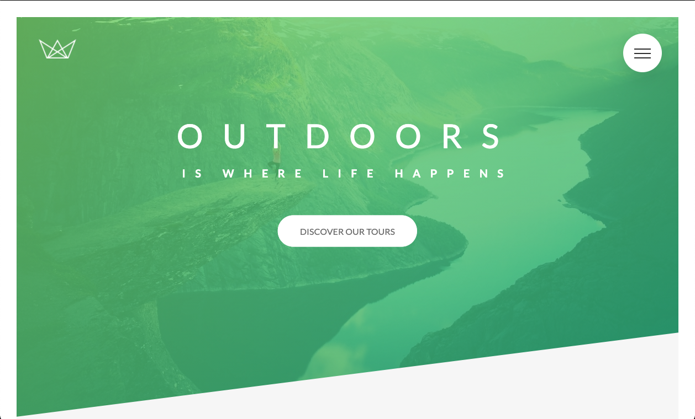
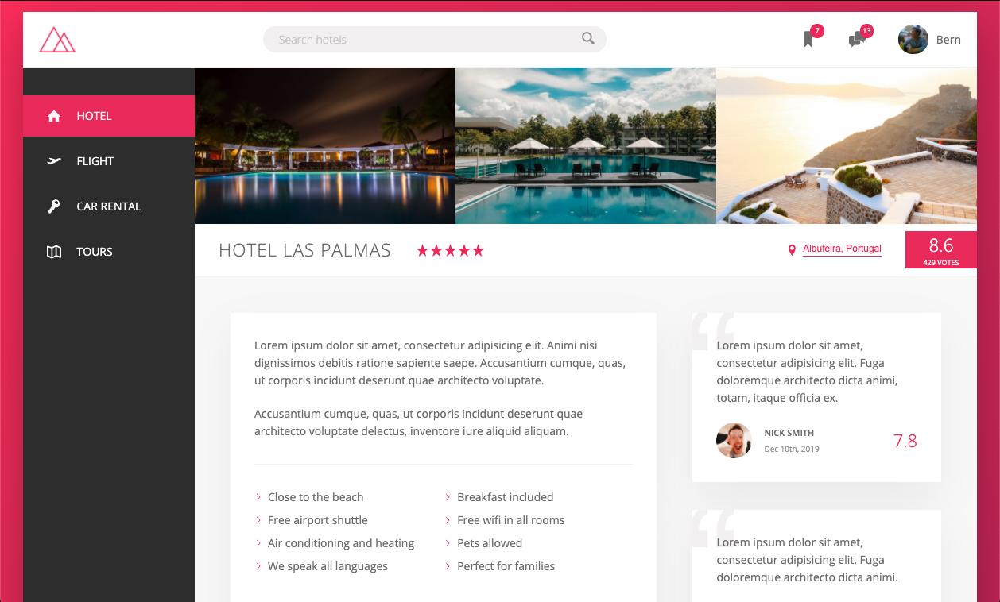

  <a href="#mountain_snow-natours">Natours</a>&nbsp;&nbsp;&nbsp;|&nbsp;&nbsp;&nbsp;
  <a href="#european_castle-nexter">Nexter</a>&nbsp;&nbsp;&nbsp;|&nbsp;&nbsp;&nbsp;
  <a href="#beach_umbrella-trillo">Trillo</a>&nbsp;&nbsp;&nbsp;|&nbsp;&nbsp;&nbsp;
  <a href="#memo-disclaimer">Disclaimer</a>

 

<h1 align="center">
  <em>Responsive Sass & CSS Webpages</em>
</h1>

A list of project directories built with HTML & Sass - a pre-processor that compiles to CSS. All projects listed here are entirely JavaScript-free and doesn't come with any backend development attached. 

In other words, it is entirely built for aesthetics purposes in mind and to gain a deeper understanding of Sass with moderen CSS.

**IMPORTANT NOTE:** _The projects here are **NOT** deployed. To open and view the projects listed here, simply type <code>git clone https://github.com/BernStrom/sass-css-projects.git</code> onto your command line to clone a copy of this repository to your local computer or download a zip file this repository by clicking the green "Code" button at the top right the page._

### :mountain_snow: Natours

     

A webpage of a tour company call 'Natours' that specializes in package tours with varying difficulty that venture into nature.

Project was built using the best practices of Sass 7-1 architecture by separating parts of the webpage into individual components for styling along with stylesheets for the base layouts of the page. The layout of the webpage here was built using floats along with Sass features such as mixins, variables, and more.

**_Floats was used to built this webpage for the purpose of gaining a better understanding of how they work in styling. It is, however, NOT a preferred option for page layouts anymore but rather the usage of modern CSS features such Flexbox and Grid are highly recommended & favorable._**

 

### :european_castle: Nexter

     

A webpage of a real estate company call 'Nexter' that specializes in luxury homes all over the world.

Sections of the webpages are separated into individual components for more maintainable styling. The base layout of the webpage was built mainly with CSS Grid and a mixture of Flexbox for its content positioning.

 

### :beach_umbrella: Trillo

     

A webpage of a travel company that offers various services such flights, hotels, car rentals, etc. It contains a mockup of a signed-in user with friends who likes a particular hotel listing with its ratings.

The layout of the webpage was built mainly on Flebox along with other modern CSS features such as variables, functions, etc.

 

## :memo: Disclaimer
The contents of these pages are provided as an information guide only. While every effort is made in preparing the material for publication, no responsibility is accepted by or on behalf of the owner(s) for any errors, omissions or misleading statements on these pages or any site to which these pages connect. Although every effort is made to ensure the reliability of listed sites this cannot be taken as an endorsement of these sites.